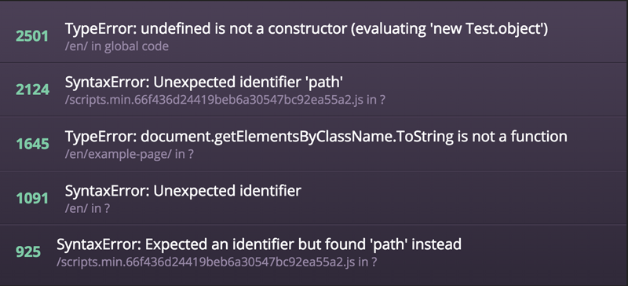

# dashing-sentry
Dashing widget for a Top 5 from Sentry error tracking



## Usage
Add job and widget files to your project.

*config.yml*
```
sentry:
  projects:
    YOUR_PROJECT_NAME:
      name: YOUR_PROJECT_NAME
      organization: YOUR_ORGANIZATION_NAME
      api_key: YOUR_API_KEY
```

*dashboard.erb*
```
<li data-row="1" data-col="1" data-sizex="2" data-sizey="1">
  <div data-id="sentry_toperrors_PROJECT_NAME" data-view="SentryTopErrors" data-title="Top 5 errors"></div>
</li>
```

## License

MIT
